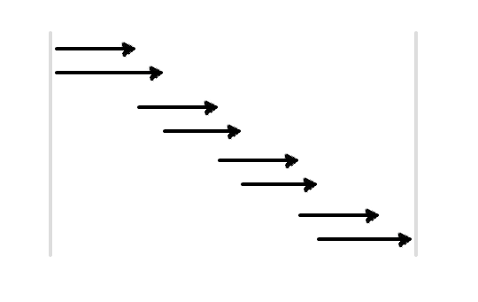

# jQuery.DeferredPipeline

manage async processes.

## Demos

* [imgs' preload](http://takazudo.github.io/jQuery.DeferredPipeline/demos/1/)

## Tests

* [all](http://takazudo.github.io/jQuery.DeferredPipeline/tests/mocha/common/)

## What this does

Basically, if you call 4 async processes, It's like this.


With jQuery.DeferredPipeline, you can queue functions like this.


```javascript
var pipeline = new $.DeferredPipeline({ pipeSize: 1 });

// queue function like this 4 times
pipeline.add(function() {
  var d = $.Deferred();
  doAsync(function() {
    d.resolve();
  });
  return d.promise();
});

pipeline.run();
```

This is just a queue. You can run specified counts' async processes at the same time like this.



```javascript
// 2 size pipeline
var pipeline = new $.DeferredPipeline({ pipeSize: 2 });

// queue function like this 8 times
pipeline.add(function() {
  var d = $.Deferred();
  doAsync(function() {
    d.resolve();
  });
  return d.promise();
});

pipeline.run();
```

## Why you need this

### Images' preload

You can reduce the CPU and network traffic costs by piping.

### Ajax requests (especially JSONP)

Multiple JSONP requests may get troubled sometimes. Because it is just a hacky JavaScript execution, so we need to keep the order of the JSONP requests.

## Usage

### Basic

like the explanation above, do

```javascript
var pipeline = new $.DeferredPipeline({ pipeSize: 2 }); // specifiy pipeSize as option

// queue functions like below
pipeline.add(function() {
  var d = $.Deferred();
  doAsync(function() {
    d.resolve();
  });
  return d.promise();
});

pipeline.run();
```

### done, fail, complete

The second argument is for the option.

```javascript
var pipeline = new $.DeferredPipeline({ pipeSize: 2 });

pipeline.add(function() {
  var d = $.Deferred();
  doAsync(function() {
    d.resolve('someValue'); // or .reject()
  });
  return d.promise();
}, {
  done: function(doneArgs) {
    // called when main function's returned promise was resolved.
    // this function can receive passed arguments as `doneArgs`
  },
  fail: function(failArgs, data) {
    // called when main function's returned promise was rejected.
    // this function can receive passed arguments as `failArgs`
    // if the main function was aborted, `true` will be set to `data.aborted`.
  },
  complete: function(doneOrFailArgs, data) {
    // called after `done` or `fail` was called.
    // this function can receive passed arguments as `doneOrFailArgs`
    // if the main function was aborted, `true` will be set to `data.aborted`.
    // if `done`, `true` will be set to `data.successed`.
    // if `fail`, `false` will be set to `data.successed`.
  }
});

pipeline.run();
```

### Stop

#### stopAll

```javascript
var pipeline = new $.DeferredPipeline({ pipeSize: 2 });

pipeline.add(...);
pipeline.add(...);
pipeline.add(...);

pipeline.run();

// then, later...

pipeline.stopAll(); // stops all queued items.
```

Then, all pending items will be not called, and about already called items, you can get the aborted stats like this.

```javascript
pipeline.add(function(stats) {
  var d = $.Deferred();
  doAsync(function() {
    if(stats.aborted) { // if pipeline was stopped, `stats.aborted` will be `true`
      d.reject();
    } else {
      d.resolve();
    }
  });
  return d.promise();
});
```

### stopAllWithoutTheLast

`stopAllWithoutTheLast` does almost same stuff as `stopAll`, but this calls the last queued item this time. This may useful for queued JSONP requests.

### Events


```javascript
var pipeline = new $.DeferredPipeline({ pipeSize: 2 });

pipeline.add(...);
pipeline.add(...);
pipeline.add(...);

pipeline.on('run', function() { ... }); // when run
pipeline.on('stop', function() { ... }); // when stopped
pipeline.on('itemRun', function() { ... }); // when any item was run
pipeline.on('itemSuccess', function() { ... }); // when any item was successed
pipeline.on('itemFail', function() { ... }); // when any item was failed
pipeline.on('itemComplete', function() { ... }); // when any item was completed
pipeline.on('allComplete', function() { ... }); // when all items were completed or stopped

pipeline.run();
```

## Depends

* [EveEve](https://github.com/Takazudo/EveEve)
* jQuery 1.10.2 (>=1.5.1)

## Browsers

IE6+ and other new browsers.  

## How to build

git clone, then `git submodule init`, `git submodule update`.  
Then, `grunt` to build or `grunt watch` to watch coffee file's change.

## License

Copyright (c) 2014 "Takazudo" Takeshi Takatsudo  
Licensed under the MIT license.

## Build

Use

 * [CoffeeScript][coffeescript]
 * [grunt][grunt]
 * [Mocha](http://mochajs.org/) for tests
 * [LearnBoost/expect.js](https://github.com/LearnBoost/expect.js/) for tests

[coffeescript]: http://coffeescript.org "CoffeeScript"
[grunt]: http://gruntjs.com "grunt"
